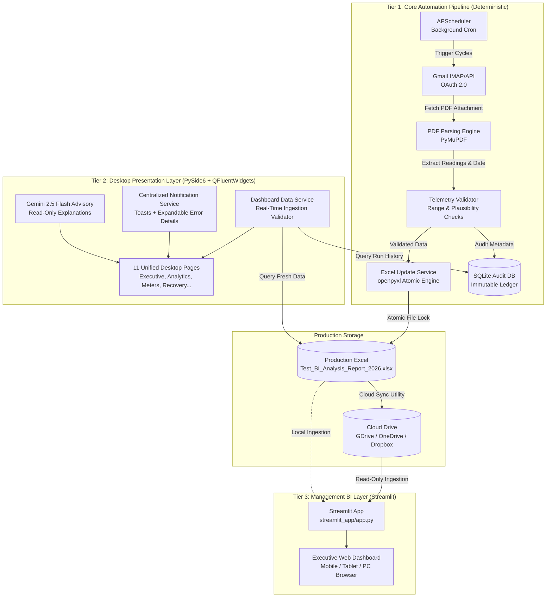

# EnergyAutomation — Architectural Blueprint & System Design

## 1. System Overview

**EnergyAutomation** is a production-grade Windows desktop enterprise automation and energy intelligence platform developed for **Savera MS**. 

The system operates across three decoupled architectural tiers:
1. **Source Automation Engine (Core Engine)**: Automated retrieval of NBSense EMS monitoring reports from Gmail, mathematical validation of electrical telemetry, atomic update of the production Excel workbook preserving formulas, and SQLite audit logging.
2. **Desktop Presentation Layer (PySide6 + QFluentWidgets)**: Windows 11 Fluent Design desktop application providing operators, plant engineers, and managers with live monitoring, system health diagnostics, historical recovery, and Gemini AI advisory insights with **zero fake telemetry**.
3. **Management Analytics Layer (Streamlit BI)**: A strictly read-only, browser-accessible business intelligence dashboard running locally or deployed to Streamlit Community Cloud with live cloud storage synchronization (Google Drive, OneDrive, Dropbox).

---

## 2. Component Architecture & Separation of Concerns



### Architectural Boundaries & Invariants

| Principle | Specification |
| :--- | :--- |
| **Sole Source of Truth** | The **Core Automation Engine** is the sole authority that writes to the Excel workbook and SQLite database. UI and Streamlit never write raw meter telemetry. |
| **Zero Fake Telemetry** | No synthetic, hardcoded, or random placeholder metrics (e.g. `2500 kWh`, `0.0`, `12-Jan-2026`). If a meter was unpolled or missing, it must be represented as `N/A` / `NaN` / `NO DATA AVAILABLE`. |
| **Excel Formula Safety** | Daily total formulas `=SUM(C{row}:Q{row})` and cumulative monthly row 4 formulas `=SUM(R5:R34)` are strictly preserved. The engine computes values in memory for validation but writes formula strings into formula cells. |
| **Unpolled Meter Handling** | Missing meter values in reports are preserved as `NaN` / `None` / empty cells—**never coerced to `0.0`**, preventing false zero-consumption anomalies in statistical calculations. |
| **Atomic File Operations** | Excel updates are performed via temporary atomic write buffers (`temp_*.xlsx`) followed by replacement and backup creation (`backups/`) to prevent workbook corruption during power loss or system lock. |
| **Read-Only Analytics** | Streamlit BI and Gemini AI operate exclusively in read-only mode with cached queries (`@st.cache_data`) and zero write access to production workbooks. |

---

## 3. Core Automation Pipeline (Tier 1)

### 3.1 Gmail Ingestion Service
- **Authentication**: Google OAuth 2.0 with local token storage (`credentials/token.json`). Automatic silent token refresh via `google-auth-oauthlib`.
- **Query Filter**: `from:alerts@nbsense.com subject:"Ems Monitoring Report" has:attachment filename:pdf`.
- **Deduplication**: SHA-256 hash checking against SQLite audit ledger to ensure identical emails and attachments are never reprocessed.

### 3.2 PDF Parsing & Extraction
- **Engine**: PyMuPDF (`fitz`).
- **Telemetry Extraction**: Scans tables and key-value blocks for report dates (`DD-MMM-YYYY`) and meter readings.
- **Header Normalization**: Normalizes plant meter tags (e.g. `EB-1`, `SOLAR`, `DG-1`, `DIPP_PT_PANEĹ`) matching target Excel workbook columns.

### 3.3 Telemetry Validation Service
- **Range Checks**: Verifies readings fall between operational bounds (`0` to `100,000,000 kWh`).
- **Total Consistency**: Confirms reported shift totals match the sum of individual feeder readings within mathematical tolerance.
- **Duplicate Prevention**: Rejects reports whose date already exists in the ledger unless explicit override is flagged.

### 3.4 Excel Persistence Engine
- **Engine**: `openpyxl`.
- **Target File**: `Test_BI_Analysis_Report_2026.xlsx`, sheet `"EMS Monitoring Report"`.
- **Row Mapping**: Dynamic matching of report date against Column 2 (Date Column).
- **Formula Protection**: Preserves column formulas in Column 18 (`=SUM(C16:Q16)`) and Row 4 (`=SUM(R5:R34)`).
- **Safe Recovery**: Handles Windows file lock conflicts (`WinError 32`) with exponential backoff and friendly user notifications.

---

## 4. Desktop Presentation Layer (Tier 2)

### 4.1 Technology Stack
- **Framework**: PySide6 (Qt 6.7+) + QFluentWidgets (Fluent Design System).
- **Styling**: Strict light/dark color tokens (`ui/design_system/tokens.py`), typography hierarchy (`ui/design_system/typography.py`).
- **Notification Engine**: `UINotificationService` with non-intrusive toasts (`InfoBar`) and expandable diagnostic dialogs (`FriendlyNotificationDialog`).

### 4.2 Dynamic Data Service (`DashboardDataService`)
- Dynamically parses `Test_BI_Analysis_Report_2026.xlsx` using `WorkbookDataValidator` with formula evaluation for uncalculated cells.
- Computes real KPIs:
  - **Latest Active Energy**: Real consumption from the most recent calendar day.
  - **Previous Shift Reading**: Real consumption from the preceding logged shift.
  - **Month-to-Date (MTD)**: Dynamic sum of all processed shift readings in the current month.
  - **System Readiness**: Real-time evaluation of Gmail token validity, workbook accessibility, database integrity, and scheduler activity.

### 4.3 Unified 11-Page Architecture
All functionality is merged into a single coherent interface with no fragmented mode switches:
1. **Executive Dashboard**: System readiness banner, live KPI cards, health matrix, top 5 consuming feeders, quick actions.
2. **Energy Analytics**: Statistical load distribution, daily/weekly trends, meter consumption breakdowns.
3. **Meter Analysis**: Comprehensive catalog of all 18 industrial meters across 7 production zones.
4. **Plant Map & Hierarchy**: Interactive visual hierarchy map of facility electrical distribution.
5. **Shift Reports & Audit**: Searchable ledger of every ingested NBSense report with SHA-256 hashes and date filters.
6. **Historical Data Recovery**: Detection of missing calendar dates, weekend gap analysis, and one-click backfilling.
7. **Google Gemini AI Insights**: Advisory natural-language energy assistant with canned prompts and offline fallback.
8. **Streamlit Management BI**: Integrated web launcher and local background server controller for the Streamlit dashboard.
9. **Alert Rule Manager**: Customizable threshold alerts, incident logs, and email dispatch status.
10. **Processing History & Logs**: Live event stream and diagnostic logs.
11. **System Configuration & Settings**: File path pickers, OAuth diagnostics, scheduler interval setup, and Guided Tour / Setup Wizard launcher.
12. **Help Center & Support**: Built-in 13-topic technical guides, electrical glossary, and troubleshooting FAQ.

---

## 5. Management BI Layer (Tier 3: Streamlit)

### 5.1 Architecture & Deployment
- **Entrypoint**: `streamlit_app/app.py`.
- **Execution Mode**:
  - **Local Desktop**: Launched via `python -m streamlit run streamlit_app/app.py` or directly from the desktop GUI on `http://localhost:8501`.
  - **Streamlit Community Cloud**: Deployed to cloud repository pointing to `streamlit_app/app.py`.
- **Data Ingestion**: Multi-source provider supporting local file paths or cloud share links (Google Drive, OneDrive, Dropbox, Nextcloud).
- **Caching**: `@st.cache_data(ttl=300)` for responsive dashboard interactions with automatic cache invalidation on new file upload.

---

## 6. Directory Structure

```text
EnergyAutomation_new/
├── app/
│   ├── bootstrap/          # Application lifecycle and dependency container
│   ├── contracts/          # Protocol definitions & interfaces
│   ├── events/             # Event bus and decoupled event handlers
│   ├── monitoring/         # Performance and telemetry metrics
│   ├── orchestration/      # Workflow orchestration & APScheduler
│   ├── persistence/        # SQLite repositories & database migrations
│   └── services/
│       ├── ai/             # Gemini 2.5 Flash advisory service
│       ├── alert/          # Energy threshold alerts & notifications
│       ├── analytics/      # Statistical consumption calculations
│       ├── excel/          # openpyxl formula-safe workbook updater
│       ├── gmail/          # OAuth 2.0 Gmail attachment fetcher
│       ├── notification/   # Windows notifications
│       ├── pdf/            # PyMuPDF parser & data extractor
│       ├── reconciliation/ # Reconciliation between PDF, DB, and Excel
│       └── validation/     # Mathematical & bounds validation
├── ui/
│   ├── dashboard.py        # Unified 11-page PySide6 desktop application
│   ├── data_service.py     # Live data binder (Zero fake telemetry)
│   ├── notification_service.py # Toast & friendly dialog notification service
│   ├── design_system/      # Design tokens, typography, Fluent components
│   ├── dialogs/            # Setup Wizard & Guided Tour (Permanent Light Theme)
│   └── widgets/            # Custom UI widgets & plant map
├── streamlit_app/
│   ├── app.py              # Streamlit BI entry point
│   ├── cloud_storage/      # Cloud drive sync adapters
│   ├── components/         # Reusable Streamlit KPI & chart components
│   └── pages_views/        # Multi-page analytics views
├── config/                 # settings.json, meters.json, zones.json
├── credentials/            # Gmail OAuth tokens & client secrets
├── data/                   # SQLite database & local staging
└── tests/                  # End-to-end, integration, and unit tests
```
