# Chapter 1: Technical Architecture Overview

EnergyAutomation is an enterprise-grade automation and business intelligence platform for manufacturing energy management. This chapter details its modular architecture, core design principles, layered separation of concerns, and component interactions.

---

## 1. High-Level System Architecture

EnergyAutomation uses a clean, layered hexagonal/modular architecture. The core domain and deterministic calculation logic are completely isolated from external I/O (GUI, Gmail, Excel, SQLite, and cloud services).

```mermaid
graph TD
    subgraph UI_Layer ["Presentation & UI Layer (PySide6 / Qt6)"]
        GUI["Modern Desktop Shell<br/>(ui/dashboard.py)"]
        Nav["Collapsible Sidebar<br/>(12 Operational Views)"]
        PlantMap["Plant Topology Map<br/>(ui/widgets/plant_map.py)"]
        AlertCenter["Alert Center<br/>(ui/dialogs/ & views)"]
        SetupWiz["Setup Wizard & Tour<br/>(ui/dialogs/)"]
    end

    subgraph Event_Layer ["In-Process Event Bus (Thread-Safe)"]
        Bus["EventBus<br/>(app/events/bus.py)"]
    end

    subgraph Orchestration_Layer ["Orchestration & Application Layer"]
        Workflow["WorkflowCoordinator<br/>(app/orchestration/workflow.py)"]
        Sched["APScheduler Service<br/>(app/scheduler/service.py)"]
        Bootstrap["Dependency Container<br/>(app/bootstrap/dependencies.py)"]
    end

    subgraph Domain_Services ["Domain & Operational Services"]
        PDF["PDF Parser & Normalizer<br/>(app/services/pdf/)"]
        Val["Data Validator<br/>(app/services/validation/)"]
        Excel["Excel Automation Service<br/>(app/services/excel/)"]
        Persist["SQLite Persistence & Audit<br/>(app/services/persistence/)"]
        Recon["Reconciliation Service<br/>(app/services/reconciliation/)"]
        Topology["Plant Topology Service<br/>(app/services/analytics/)"]
        Alerts["Alert Service<br/>(app/services/alert/)"]
        PowerBI["Power BI Star Schema Generator<br/>(app/services/powerbi/)"]
        AI["Gemini AI Advisory Layer<br/>(app/services/ai/)"]
    end

    subgraph External_IO ["External Systems & Storage"]
        GmailIO["Gmail REST API<br/>(NBSense Report Emails)"]
        PDFIO["NBSense Daily PDF<br/>(Filesystem / Data)"]
        ExcelIO["Production Workbook<br/>(Test_BI_Analysis_Report_2026.xlsx)"]
        SQLiteIO["Local Audit Database<br/>(data/energy_audit.db)"]
        PBIIO["Power BI Service / Fabric<br/>(REST API Push Dataset)"]
        GeminiIO["Google Gemini 2.5 API<br/>(Conversational Advisory)"]
    end

    GUI --> Workflow
    Sched --> Workflow
    Workflow --> Bus

    Workflow --> PDF
    Workflow --> Val
    Workflow --> Excel
    Workflow --> Persist
    Workflow --> Recon
    Workflow --> Alerts
    Workflow --> PowerBI
    Workflow --> AI

    PDF -.-> Bus
    Val -.-> Bus
    Excel -.-> Bus
    Alerts -.-> Bus

    Bus -.-> GUI
    Bus -.-> PlantMap
    Bus -.-> AlertCenter

    PDF --> PDFIO
    Excel --> ExcelIO
    Persist --> SQLiteIO
    PowerBI --> PBIIO
    AI --> GeminiIO
```



---

## 2. Core Architectural Invariants

The design of EnergyAutomation is governed by five non-negotiable invariants:

### Invariant 1: Deterministic Single Source of Truth
The calculation of energy consumption, meter matching, unit conversions, and spreadsheet updates is strictly deterministic. No heuristic guesswork or LLM outputs are ever inserted into calculation or persistence pipelines.

### Invariant 2: Mathematical Baseline Total
For the baseline reference report (`15-02-2026`), the sum of active energy across all 18 mapped plant meters must total exactly **9,206.83 kWh**.

### Invariant 3: `N/A` Preservation Policy
Meters with communication failure or unpolled channels report `N/A`. The pipeline strictly enforces `N/A != 0.0`. A reading of `N/A` is never coerced to zero, avoiding artificial distortion of machine baselines or cumulative efficiency curves.

### Invariant 4: Formula & Layout Immunity
Excel formula cells in row 16 (`=SUM(C16:Q16)`) and row 4 (`=SUM(R5:R34)`, `=SUM(C5:C34)`) are never overwritten with static scalar numbers. Modifications occur solely on designated date cells, and formula integrity is programmatically verified post-write.

### Invariant 5: Complete Failure Isolation
Secondary subsystems (Power BI Cloud Push, Gemini AI Advisory, Email Dispatch) are isolated via the `EventBus`. If an external internet connection drops or a cloud API returns an HTTP 500 error, the local Excel update, SQLite audit, and plant alerts complete with 100% success.

---

## 3. Directory Layout & Layer Mapping

```text
EnergyAutomation_new/
├── app/
│   ├── bootstrap/          # Dependency injection container & runtime startup
│   ├── config/             # System settings, paths, defaults, and environment loader
│   ├── core/               # Pure domain entities, value objects, and interfaces
│   ├── events/             # Thread-safe in-process EventBus and domain event types
│   ├── orchestration/      # WorkflowCoordinator managing sequential pipeline execution
│   ├── scheduler/          # APScheduler background automation and concurrency locks
│   └── services/           # Decoupled domain service implementations
│       ├── ai/             # Google Gemini integration with deterministic rule fallback
│       ├── alert/          # Centralized AlertService and threshold rules engine
│       ├── analytics/      # Plant topology, zone aggregation, baseline analytics
│       ├── excel/          # Openpyxl workbook manager, path safety, formula verifier
│       ├── gmail/          # Gmail API OAuth client and PDF attachment extractor
│       ├── pdf/            # PyMuPDF parser, table extractor, unit normalizer
│       ├── persistence/    # SQLite database repository, schema migrations, audit log
│       ├── powerbi/        # Star schema generator, DAX builder, REST push client
│       ├── reconciliation/ # Missing date gap detector, shift & weekend classifier
│       └── validation/     # Business rule validator (bounds, types, duplicates)
├── ui/                     # Presentation layer (PySide6 / Qt6)
│   ├── dialogs/            # Setup wizard, guided tour, manual upload dialogs
│   ├── widgets/            # Plant topology map, KPI cards, metric tables, charts
│   └── dashboard.py        # Main application shell with collapsible sidebar
├── docs/                   # Comprehensive documentation suite (User, Admin, Technical)
├── tests/                  # Pytest test suite (Unit, Integration, End-to-End)
├── config/                 # User-customizable settings.json
├── data/                   # Workbooks, backups, SQLite database, Power BI exports
└── run.py                  # Single entry point supporting GUI and headless modes
```
