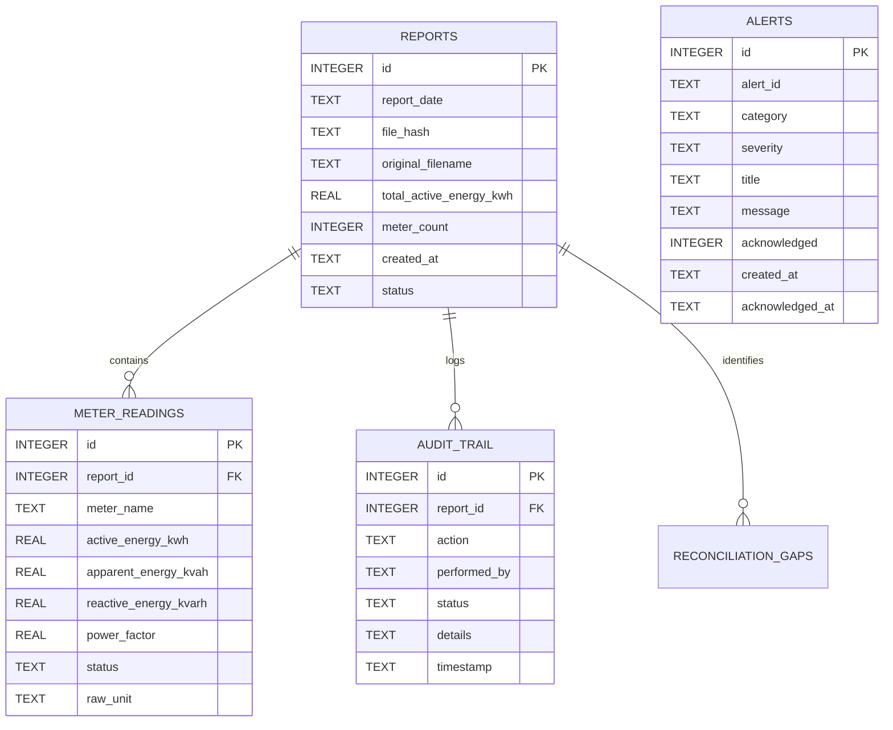
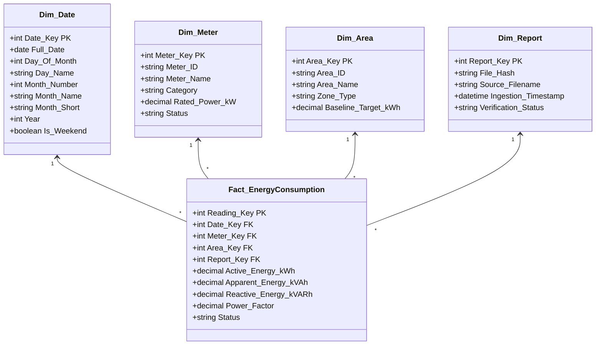

# Chapter 3: Data Model & Power BI Star Schema

This chapter documents the relational SQLite operational schema and the analytical Power BI Star Schema dimensional model implemented in EnergyAutomation.

---

## 1. Operational Relational Schema (SQLite)

The local transactional database is stored at `data/energy_audit.db` using SQLite with WAL (Write-Ahead Logging) enabled.



---

## 2. Power BI Analytical Star Schema

For high-performance analytical slicing, time-intelligence, and cross-filtering in Power BI and Microsoft Fabric, data is transformed into a pure dimensional **Star Schema**:



---

## 3. Star Schema Table Definitions

### 1. `Fact_EnergyConsumption`
- **Grain**: One record per physical meter reading per calendar day.
- **Foreign Keys**:
  - `Date_Key`: Integer surrogate key in `YYYYMMDD` format (e.g. `20260215`).
  - `Meter_Key`: Integer surrogate key pointing to `Dim_Meter`.
  - `Area_Key`: Integer surrogate key pointing to `Dim_Area`.
  - `Report_Key`: Integer surrogate key pointing to `Dim_Report`.
- **Degenerate Dimensions / Measures**:
  - `Active_Energy_kWh`: Decimal $(12, 2)$, NULL if unpolled.
  - `Apparent_Energy_kVAh`: Decimal $(12, 2)$.
  - `Reactive_Energy_kVARh`: Decimal $(12, 2)$.
  - `Power_Factor`: Decimal $(4, 3)$, calculated as $\frac{\text{kWh}}{\text{kVAh}}$.

### 2. `Dim_Date`
- Contains contiguous calendar dates supporting Power BI time-intelligence functions (`DATESMTD`, `SAMEPERIODLASTYEAR`). Includes boolean flags for `Is_Weekend` and `Is_Sunday` to support automatic plant shutdown reconciliation.

### 3. `Dim_Meter`
- Contains meter master attributes, including physical hardware tag, human-readable display label, and plant electrical hierarchy tier (`Incomer`, `Primary PDB`, `Machine Cell`, `Auxiliary`).

### 4. `Dim_Area`
- Groups meters into 7 functional manufacturing zones:
  1. Main Substation (`SUB-01`)
  2. Press Shop & Stamping (`PRS-01`)
  3. Machining & CNC Cells (`MCH-01`)
  4. Welding & Fabrication (`WLD-01`)
  5. Utility & Compressed Air (`UTL-01`)
  6. Paint & Heat Treatment (`PNT-01`)
  7. Administration & Logistics (`ADM-01`)

---

## 4. Production DAX Measures (`measures.dax`)

The following DAX formulas are pre-compiled and exported with the model:

```dax
-- Total Facility Active Energy
Total Active Energy (kWh) = 
SUM(Fact_EnergyConsumption[Active_Energy_kWh])

-- Main Incomer Consumption
Main Incomer Active Energy (kWh) = 
CALCULATE(
    SUM(Fact_EnergyConsumption[Active_Energy_kWh]),
    Dim_Meter[Category] = "Incomer"
)

-- Sum of Downstream Sub-meters
Total Sub-Meters Active Energy (kWh) = 
CALCULATE(
    SUM(Fact_EnergyConsumption[Active_Energy_kWh]),
    Dim_Meter[Category] <> "Incomer"
)

-- Electrical Distribution Loss (kWh)
Distribution Loss (kWh) = 
[Main Incomer Active Energy (kWh)] - [Total Sub-Meters Active Energy (kWh)]

-- Electrical Distribution Loss Percentage
Distribution Loss % = 
DIVIDE([Distribution Loss (kWh)], [Main Incomer Active Energy (kWh)], 0)

-- Facility Weighted Power Factor
Average Power Factor = 
DIVIDE(
    SUM(Fact_EnergyConsumption[Active_Energy_kWh]),
    SUM(Fact_EnergyConsumption[Apparent_Energy_kVAh]),
    1.0
)

-- Baseline Variance Percentage
Baseline Variance % = 
VAR ActualEnergy = [Total Active Energy (kWh)]
VAR TargetEnergy = SUM(Dim_Area[Baseline_Target_kWh])
RETURN
DIVIDE(ActualEnergy - TargetEnergy, TargetEnergy, 0)
```
