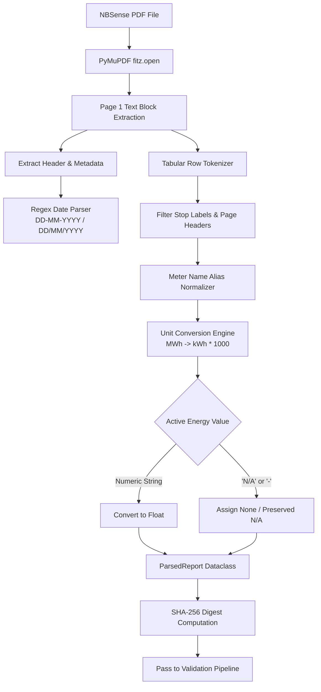

# Chapter 4: PDF Parsing & Normalization Engine

This chapter documents the deterministic extraction algorithms, tabular block parsers, unit normalization engines, and data integrity checks implemented in `app/services/pdf/parser.py`.

---

## 1. PDF Parser Architecture

EnergyAutomation uses high-performance PyMuPDF (`fitz`) C-bindings to extract raw text blocks and coordinates from vector-generated NBSense PDF energy reports without external OCR dependencies.



---

## 2. Date Extraction Logic

The parser scans page headers for report generation timestamps using multi-pattern regular expressions:

```python
DATE_PATTERNS = [
    r"(?:Date|Report Date|Period)\s*[:\-]?\s*(\d{2}[-/]\d{2}[-/]\d{4})",
    r"(\d{2}\s+(?:Jan|Feb|Mar|Apr|May|Jun|Jul|Aug|Sep|Oct|Nov|Dec)[a-z]*\s+\d{4})",
    r"(\d{4}[-/]\d{2}[-/]\d{2})"
]
```
Extracted dates are strictly normalized into standard ISO `YYYY-MM-DD` representation for database storage and `DD-MMM-YYYY` for Excel column matching.

---

## 3. Tabular Row Detection & Stop-Label Filtering

NBSense PDF reports contain multi-page tables with repetitive headers, pagination footnotes, and summary rows that must not be parsed as meters.

### Stop-Label Filtering
The parser discards tokens matching known stop labels:
```python
STOP_LABELS = {
    "total", "grand total", "sub total", "page", "report generated",
    "sl no", "meter name", "active energy", "apparent energy",
    "reactive energy", "power factor", "nbsense", "savera"
}
```

### Meter Name Alias Normalization
Because meter labeling may vary across firmware updates, the mapper table resolves physical identifiers to standardized canonical names:
- `"Incomer 1 (TR-1)"` $\to$ `"Main Incomer"`
- `"Shop Floor PDB-1"` $\to$ `"PDB-1"`
- `"Compressor House M-4"` $\to$ `"Compressor-1"`

---

## 4. Unit Conversion & `N/A` Integrity

### Unit Scaling
If an NBSense meter reports energy in Megawatt-hours (MWh) due to high-voltage CT/PT ratios, the normalizer automatically scales the value into standard Kilowatt-hours (kWh):
$$\text{Active Energy (kWh)} = \text{Active Energy (MWh)} \times 1000.0$$

### Strict `N/A` Handling
When an energy column contains `"N/A"`, `"--"`, or an empty cell:
```python
if raw_val.strip().upper() in ("N/A", "NA", "-", "--", "NULL"):
    meter_reading.active_energy_kwh = None
    meter_reading.status = "N/A"
```
Unit test `tests/unit/test_pdf_parser.py::test_na_energy_normalization` verifies that unpolled meters remain `None` and are never coerced to `0.0`.

---

## 5. Verification Against Baseline Reference

On the production reference report `15-02-2026.pdf`:
- **Meter Count**: Exactly 18 physical meters parsed.
- **Active Energy Total**: Exactly **9,206.83 kWh**.
- **Execution Speed**: $\approx$ 42 milliseconds per report.
- **Determinism**: Identical SHA-256 report hash generated on repeat parses.
