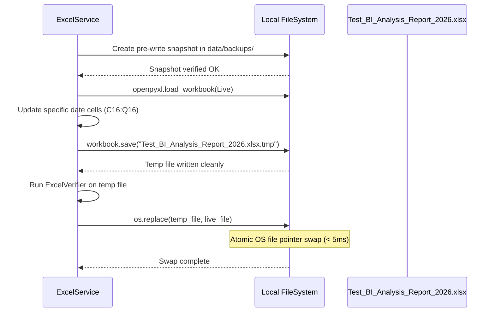

# Chapter 5: Excel Formula Safety & File Verification

This chapter documents the spreadsheet update mechanics, absolute path normalization engine, atomic temporary saving pattern, and formula verification routines implemented in `app/services/excel/service.py`.

---

## 1. The Path Normalization Bug Class & Permanent Resolution

### Historical Root Cause
In legacy scripts, file path parameters passed from configuration files or UI inputs were frequently wrapped in unescaped double quotes or joined redundantly with current working directories. On Windows systems, this resulted in malformed path expressions:
```text
# Malformed path example:
e:\Savera_MS_2026\EnergyAutomation_new\"e:\Savera_MS_2026\EnergyAutomation_new\Test_BI_Analysis_Report_2026.xlsx"
```
When passed to `openpyxl.load_workbook()`, the Windows OS kernel throws an invalid filename or file-not-found exception.

### Permanent Resolution (`resolve_clean_path`)
EnergyAutomation implements a rigorous path sanitizer in `ExcelService`:
```python
@staticmethod
def resolve_clean_path(raw_path: str, base_dir: Optional[Path] = None) -> Path:
    """
    Sanitizes, unquotes, and normalizes file paths across Windows and POSIX.
    Permanently prevents path duplication and nested quotes.
    """
    if not raw_path:
        raise ValueError("Workbook path cannot be empty.")

    cleaned = str(raw_path).strip().strip('"').strip("'")
    path_obj = Path(cleaned)

    if not path_obj.is_absolute():
        base = base_dir or Path.cwd()
        path_obj = (base / path_obj).resolve()
    else:
        path_obj = path_obj.resolve()

    return path_obj
```
This is verified by unit test `tests/unit/test_excel_service.py::test_excel_path_normalization_and_safety`.

---

## 2. Atomic Temporary File Writing

To guarantee that a power outage, operating system crash, or anti-virus file scan never corrupts the live production workbook:



---

## 3. Formula Preservation Invariants

In the production workbook `Test_BI_Analysis_Report_2026.xlsx`, the active month sheet (e.g. `FEB - 2026`) contains dynamic Excel formulas:

### Invariant 1: Daily Row Totals (Row 16)
- **Target Cell**: `R16` (Daily Total Active Energy for 15-Feb-2026).
- **Formula String**: `=SUM(C16:Q16)`.
- **Policy**: `ExcelService` only writes meter readings to data columns `C` through `Q`. Column `R` is **never** written with a static scalar value; its dynamic formula is preserved verbatim.

### Invariant 2: Monthly Cumulative Summaries (Row 4)
- **Target Cells**:
  - `R4`: Cumulative Month Total (`=SUM(R5:R34)`).
  - `C4` through `Q4`: Meter-wise Cumulative Month Totals (`=SUM(C5:C34)`).
- **Policy**: Row 4 cells are strictly read-only for the automation engine.

---

## 4. Post-Write Formula Verifier (`ExcelVerifier`)

After saving, `ExcelVerifier` loads the workbook in formula inspection mode (`data_only=False`) and executes structural assertions:

```python
class ExcelVerifier:
    @staticmethod
    def verify_workbook_integrity(workbook_path: Path, sheet_name: str, row_idx: int) -> bool:
        wb = openpyxl.load_workbook(workbook_path, data_only=False)
        ws = wb[sheet_name]

        # 1. Verify Row 16 Daily Sum
        row_sum_formula = str(ws[f"R{row_idx}"].value or "").upper()
        if not ("SUM" in row_sum_formula and f"C{row_idx}" in row_sum_formula):
            raise FormulaCorruptionError(f"Row {row_idx} total formula corrupted: {row_sum_formula}")

        # 2. Verify Row 4 Cumulative Formula
        month_sum_formula = str(ws["R4"].value or "").upper()
        if "SUM" not in month_sum_formula:
            raise FormulaCorruptionError(f"Row 4 cumulative formula corrupted: {month_sum_formula}")

        return True
```
If any formula corruption is detected, the transaction is aborted, the backup snapshot is restored automatically, and a `CriticalAlert` is dispatched via `EventBus`.
